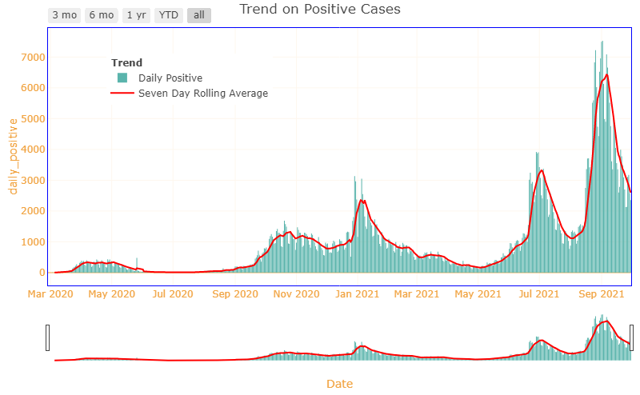
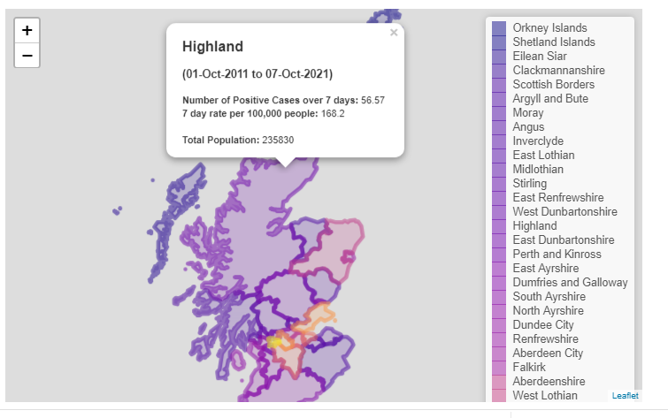
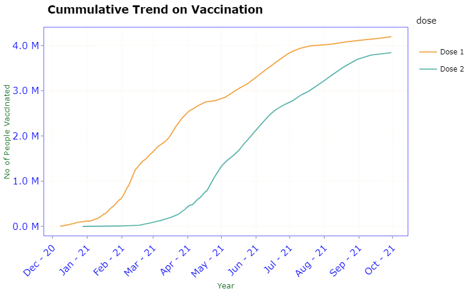
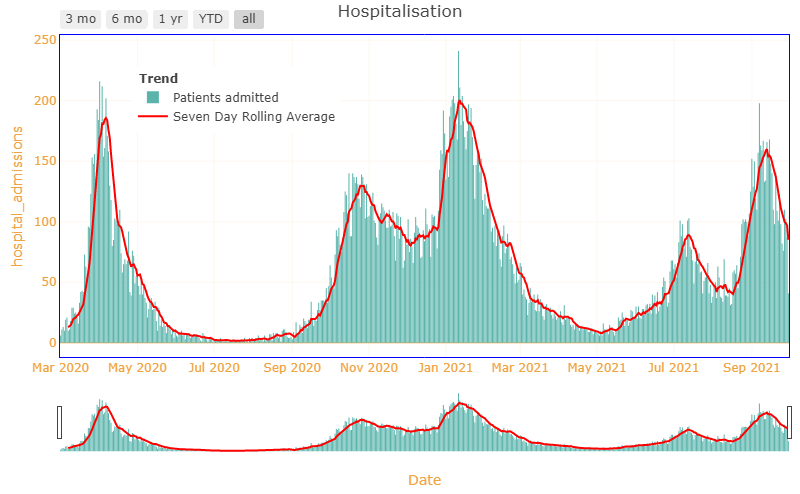
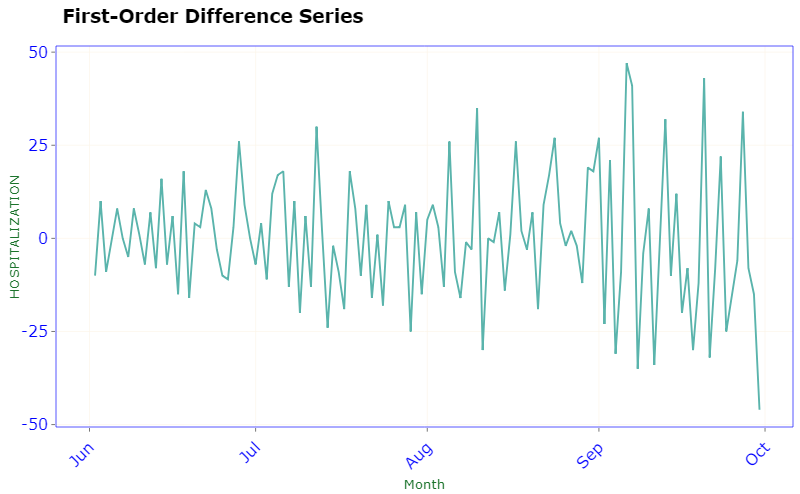
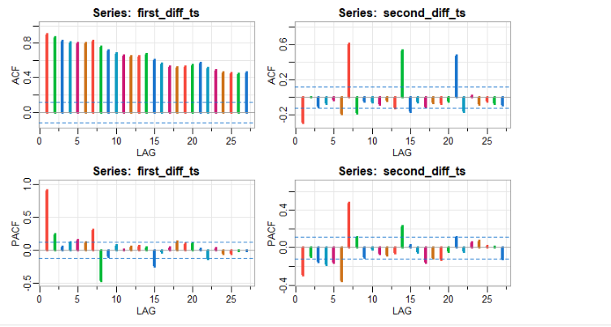
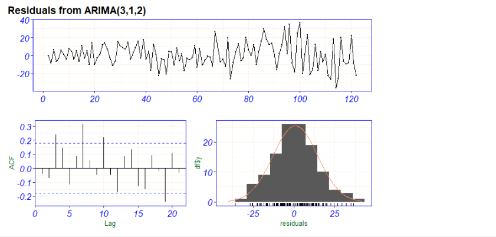
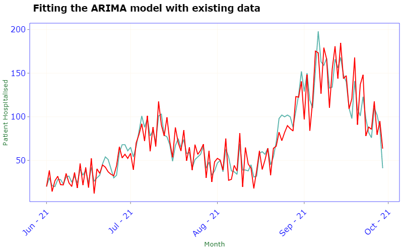
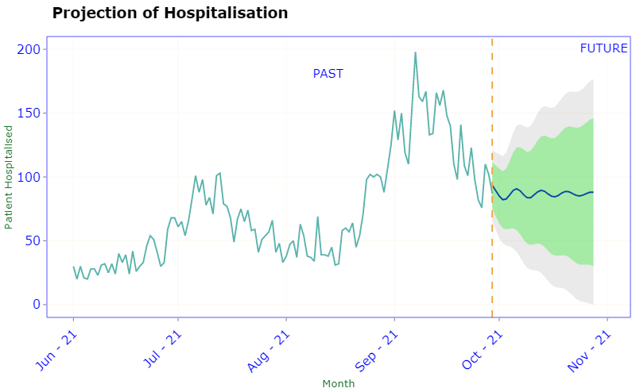

# PHS COVID-19 : Preparing for winter

## Domain knowledge and the business context

Public Health Scotland is Scotland's national health improvement agency
and one of the country's main national public health bodies. We take a
population focus, working to understand and influence what makes
communities, regions, and countries more or less healthy. These factors
that impact on health are known as the determinants of health.

COVID-19 is a serious pandemic, which created a wealth of public health
data. The focus of this analysis is to prepare for winter with COVID-19
in place using the data provided by the Public Health of Scotland.

**Tools Used:** R, Plotly, Slidy Presentation

**Concepts used:** Time Series Forecasting using ARIMA Model

## Business Questions:

-   How the daily positive cases changes over time ?

-   What has the vaccination coverage and its progression been?

-   Analyzing hospitalization and fatality trends

-   Projection of hospitalization and deaths in near future

**Data Source:**

All covid data is provided by Public Health Scotland:
<https://www.opendata.nhs.scot/dataset/covid-19-in-scotland>

**Challenges:**

The data was converted to Time Series for forecasting and model
building. Handling and converting data to time series and incorporating
them into model is quite tricky. Also the time series data uses autoplot
for plotting which has its own restrictions when plotting. I converted
them into ggplot and implemented ggplotly for interactive version

**Functions:**

A function *calculate_roll_avg* is created to handle the RollingAverage
which is being widely used to calculate the increase or decrease in the
cases.

A function *convert_to_timeseries* is created to convert the data to
timeseries.

**Analysis:**

All the analysis documents are available in the **analysis** folder
*(both Rmd and R)*

The overall analysis is available in the document
**analysis/Rmd/PHS_COVID_ALL.Rmd**

The detailed analysis of individual topic is available in the following
sections

1_Exploratory_analysis.Rmd

2_Vaccination Analysis (ARIMA Modelling).Rmd

3_Hospitalisation Analysis (ARIMA Modelling).Rmd

4_COVID_Deaths Analysis (ARIMA Modelling).Rmd

The files are labelled accordingly to the order of execution. The same
files are also available in R.

Some plots demonstrating the insights

**Daily Cases**:

-   There were total of 571,421 Positive cases reported as of 6th of
    October in Scotland.

-   Between 23 September 2021 and 30 September 2021, 21,279 people had a
    confirmed positive test result. This shows a decrease of 9.66%
    compared to the previous 7 days.

**Vaccination**

As of 30th September in Scotland,

4,195,393 people had been given first dose 3,842,053 people had been
given second dose

**COVID-19 Hospitalizations and Deaths Hospital admissions**

-   There were total of 34,624 patients admitted in hospital and total
    of 2572 patients admitted in ICU.

-   Between 23 September 2021 and 30 September 2021, 719 had been
    hospitalized with COVID Positive. This shows a decrease of 15.11%
    compared to the previous 7 days.

-   There were total of 8726 Deaths reported.

**COVID-19 Hospitalisation Projection: ARIMA Model(p,d,q):**

**COVID-19 Deaths Projection ARIMA Model(p,d,q):**

### Summary:

-   **Daily Cases** trend seems to be declining as we see a **decrease
    of 9.66%** when compared to previous 7 days.

-   Almost **91.43%** of the people are vaccinated with **Dose 1** and
    **84.45%** of the people are vaccinated with **Dose2**.

### Projections:

-   **Hospitalization** shows a **decrease of 15.11%** when compared to
    previous 7 days.

-   The ARIMA model projects that the hospitalizations might drop, based
    on the declining trend of the current COVID-19 Hospitalizations,

-   The ARIMA model also projects that the weekly deaths maintains at
    the same level.

-   However potential future changes in hospital occupancy and intensive
    care use is highly uncertain as it is also dependent on both
    **current infection levels** and how the **vaccination** impact will
    be.

### Future Proposal:

-   Even though the trends on daily positive cases, hospitalizations and
    death seems to be declining in Scotland, England shows an increase
    in all the categories.

-   Given that the border is fully open, this model could be expanded to
    include data from the whole of UK which might give a different
    perspective.

-   As a preventive measure, the travel restriction might help to reduce
    the spread of infection and control the hospitalization.

-   With winter approaching, considering the previous trend, its better
    for the hospitals to be prepared.
